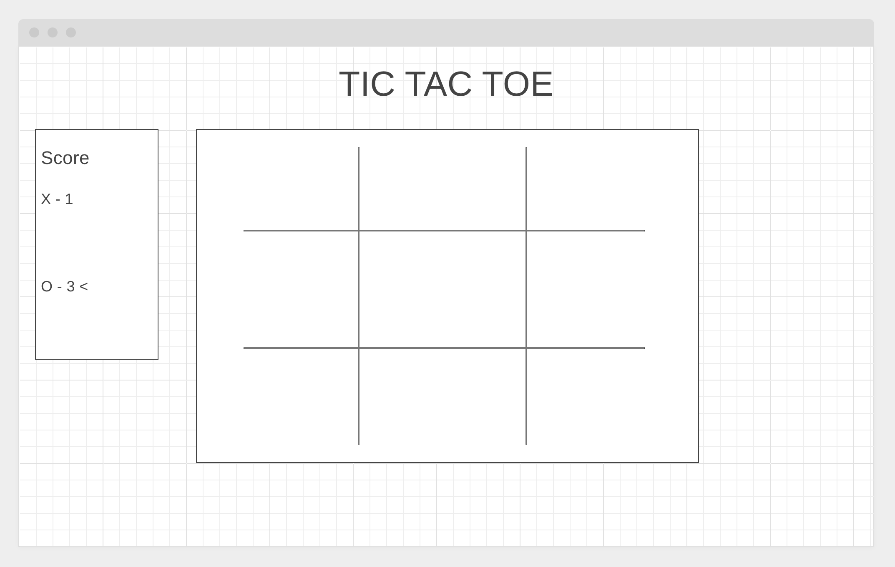

# Tic-Tac-Toe

### Installation: [Github Pages](https://gatlin-carrier.github.io/tic-tac-toe/index.html), or download/clone the repo above.

# Technologies

- HTML5
- CSS3
- Vanilla Javascript
- [Tilt.js](https://micku7zu.github.io/vanilla-tilt.js/): A library that makes the tilt animations possible
- [Animate.css](https://daneden.github.io/animate.css/): Creates the pulse effect when the win condition is met.

- Git, Github, Github Pages: Version Control and hosting.
- VSCode: Code editor, formatted with Prettier.
- [wireframe.css](https://wireframe.cc/): Website used to create wireframe mockup.

# User Stories

- As a user, I want to be able to be able to play against another user or myself so that I can enjoy the game alone or with friends.

- As a user, I can click a button to change between AI and player versus player game modes.

- As a user, I can click a button to reset the board so that I can play another match.

- As a user, I can click a tile and that tile will turn into either an X or an O depending on whose turn it is so that I can play a full match.

- As a user, I want to be able to keep track of my score so that I can brag about beating someone in Tic-Tac-Toe.

- As a user, I want some sort of feedbak that lets me know who won or if there is a tie.

# Wireframe

# Approach

My approach isn't the DRYest method, but it works. I have every combination in a single function which is called each time a user clicks a tile to make sure a win condition has been met or not. If it hasn't, then the function adds 1 to a global turn counter variable. The turn counter is then checked to see if it is even or odd, and based on that an "X" or an "O" is set in that tile.

For my AI, it simply will find a random empty tile and change the inner text to "O" after the user has clicked their tile.

# Unsolved Problems

1. Currently the AI can still be a bit buggy which will need to be fixed.

2. I have a lot of non-DRY code that code be refactored.

3. I want to add an impossible AI eventually.
